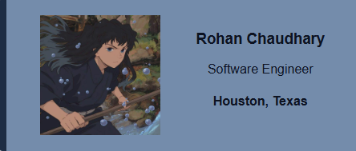
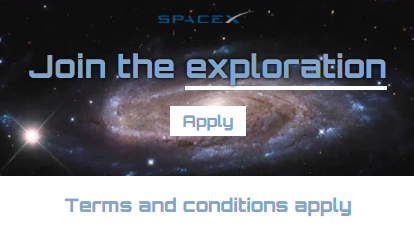
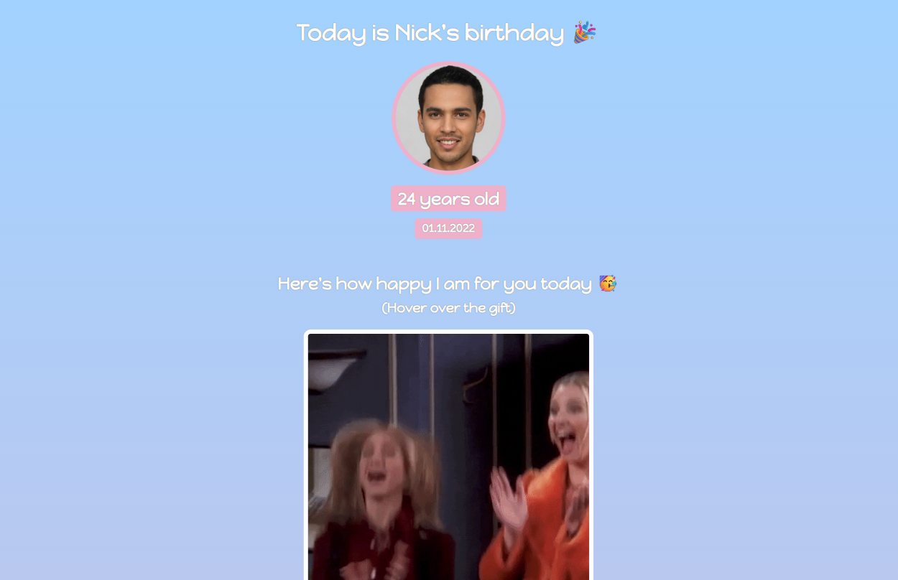
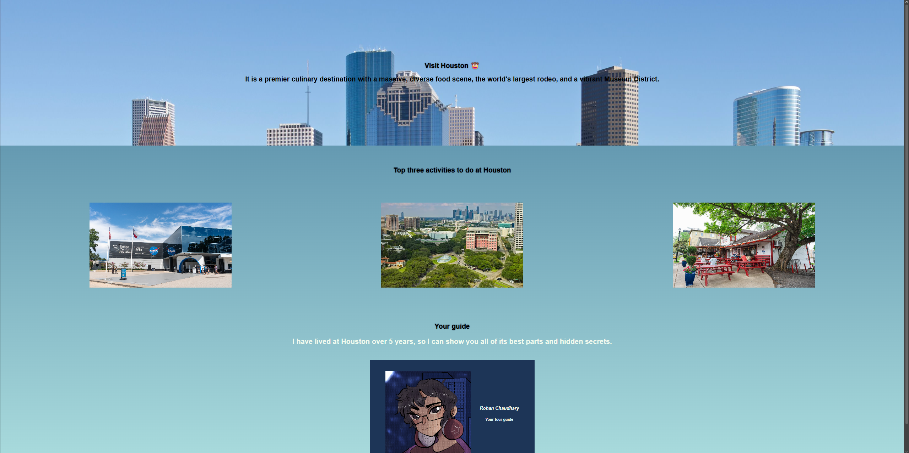

# Scrimba HTML & CSS Projects 🚀

This repository is a collection of all the projects I built while completing the Scrimba HTML & CSS path.
---

## 📇 Project 1: Digital Business Card
A simple, elegant digital business card built to practice CSS Flexbox and typography.

* **Key Learnings:** Flexbox alignment, hover effects, inheritence, shorthand.

---
## 🌠 Project 2: Space-exploration
A space-exploration sign up page.

* **Key Learnings:** Span tags, Text-shadow, Google Fonts, Image background

---
## 🎂 Project 3: Birthday Website
A Birthday website with gifts that turn into GIFs when you hover over them !

* **Key Learnings:** Gradients, flex-direction, :hover
* **Tech Stack:** HTML5, CSS3

---
## 🤠 Project 4: Hometown website
A houston tourism website :D.

* **Key Learnings:** All of the above!
* **Tech Stack:** HTML5, CSS3

---
